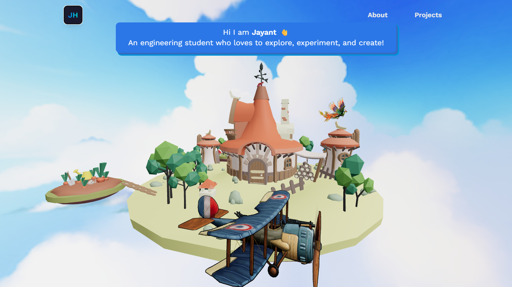
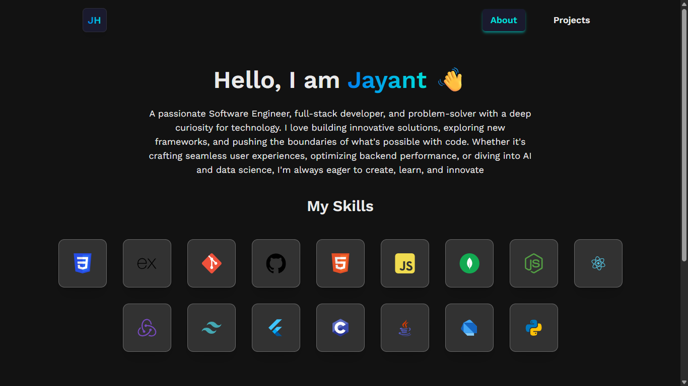
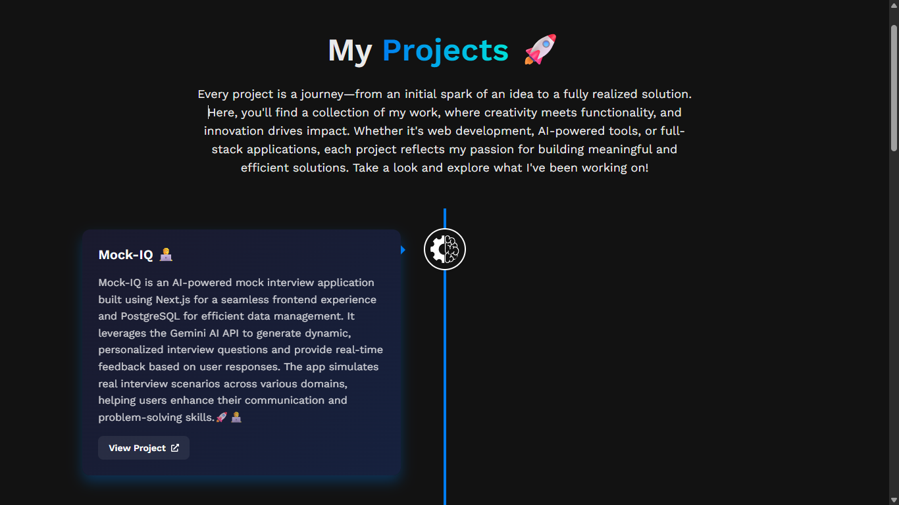
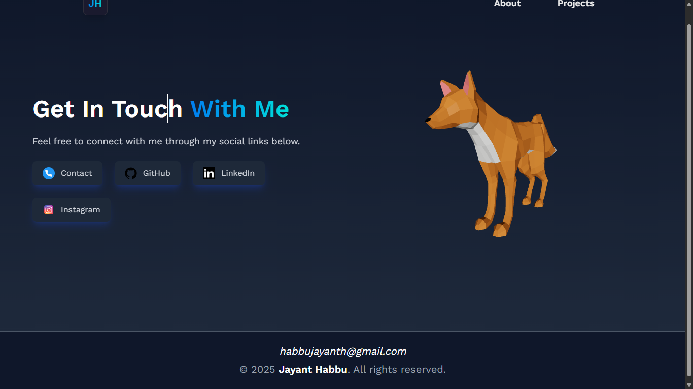

# 🎨 My-Portfolio

**My-Portfolio** is a **visually immersive portfolio website** built with **Three.js**, showcasing interactive 3D elements and smooth animations.  
It is designed to highlight creativity, skills, and projects with a modern and engaging web experience.

🌐 **Live Demo:** [my-portfolio-six-eta-slixfxbndj.vercel.app](https://my-portfolio-six-eta-slixfxbndj.vercel.app)

---

### 📚 Topics & Tech Stack

- ✨ **Three.js** — 3D graphics and rendering
- ⚛️ **React** — Component-based UI 
- 💄 **CSS3** — Styling and layouts
- 🚀 **Vercel** — Deployment platform

---

### 🚀 Features

- ✅ Stunning 3D visuals rendered with Three.js  
- ✅ Smooth and interactive animations  
- ✅ Showcases personal projects, skills, and creativity  
- ✅ Modern, responsive, and accessible design  
- ✅ Easy to customize and extend  

---

### 📸 Screenshots

#### 🏠 Home Page


#### 🏠 About Page


#### 📂 Projects Section


#### 📞 Contact Section



---

### 🛠️ Getting Started

### 1️⃣ Clone the repository
```bash
git clone https://github.com/your-username/My-Portfolio.git
cd My-Portfolio
```

### 📦 Install Dependencies

To install all dependencies at once:
```bash
npm install
npm install three
npm install gsap
```

### 🚀 Run Development Server
```bash
npm start
```

### 👥 Authors & Acknowledgments

This project is developed and maintained by:

- **Jayant Habbu** — [@jay1535](https://github.com/jay1535)

Special thanks to:

- The developers of [Three.js](https://threejs.org/), [GSAP](https://gsap.com/), and [Vercel](https://vercel.com/) for providing the amazing tools that power this application.
- Everyone who has contributed ideas, feedback, and inspiration to improve **My-Portfolio**!

